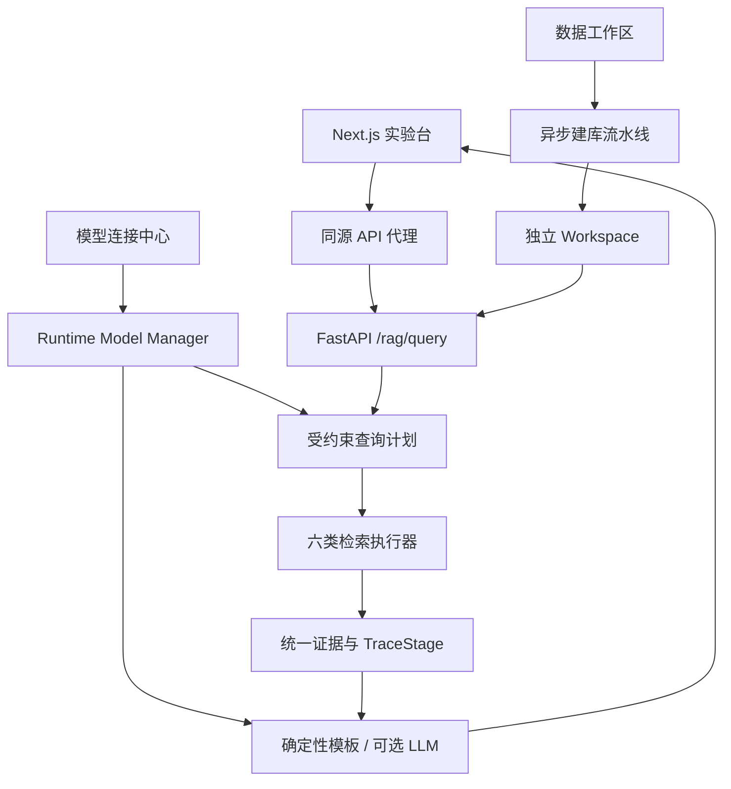

# 系统架构

## 1. 统一请求链



浏览器只请求 Next.js 的同源 `/api/*` 路由；Next.js 服务端再访问 FastAPI。数据库凭据始终只在后端；学生输入的模型 Key 通过 HTTPS/本机回环提交给后端，后续读取只返回掩码。

浏览器通过同源代理上传文件并轮询 ingestion job；浏览器提交模型配置后，明文 Key 只保留在 FastAPI 当前进程，配置读取接口只返回掩码和就绪状态。模型检测、文档上传、表上传、属性图上传和任务轮询都有与前端调用地址一一对应的 Next.js Route Handler。工作区查询请求必须携带 `workspace_id`，后端先验证该工作区允许的检索模式，再选择内置执行器、文档执行器、通用表执行器或内嵌属性图执行器。

每个执行器都返回相同的四类对象：

- `answer`：未启用 LLM 时也可复现的确定性答案。
- `stages`：前端逐步呈现的执行轨迹。
- `evidence`：带来源标识的证据。
- `metrics`：耗时、召回数量、图规模等指标。

## 2. 三类数据及其职责

| 数据容器 | 核心结构 | 擅长回答 | 本项目实现 |
|---|---|---|---|
| 文档语料 | 文本块、词项、向量 | “哪些片段语义或词项最接近？” | JSONL + TF–IDF/BM25 + 持久化 FAISS |
| 属性图 | 带属性的节点和有类型的边 | “从这个实体沿哪些关系能找到邻域？” | 内置库可用 Neo4j；学员工作区使用 SQLite 邻接索引 + FAISS |
| RDF 图 | 主语—谓语—宾语三元组与本体 | “哪些事实满足可推理、可交换的语义约束？” | Fuseki，失败时回退 RDFLib |
| 关系数据库 | 表、主外键、约束与索引 | “严格过滤后有多少条？如何分组？” | SQLite |

它们不是互相替代。综合模式让每类数据库只承担它最可靠的子问题。

## 3. 文档检索

### TF–IDF

1. 查询分词并执行同义词归一。
2. 对查询词计算 `TF × IDF`。
3. 查询和每个文档投影到同一份固定的 110 维语料词表；未出现的坐标显式为 0。
4. 分别计算完整向量的 L2 范数并归一化。
5. 同坐标逐维相乘、累加为点积；再除以两向量范数得到余弦相似度。

前端不是只画查询里的几个词。它先渲染完整词表坐标室，点亮非零维度，再展示每个查询词的 `tf、df、idf、tf×idf`、原始向量、归一化向量；余弦工作台把查询向量和候选文档向量放在同一坐标轨道，显示逐维乘积、分子、分母和最终分数。画面数值直接来自后端执行轨迹，不在浏览器里伪造。

### BM25

BM25 仍然是稀疏检索，但不把文档简单看成归一化词频向量。它加入：

- `k1`：控制同一词重复出现时的收益饱和。
- `b`：控制文档长度归一化强度。
- `avgdl`：语料平均长度。

前端先用语料空间显示 `N、df、idf`，再为每个候选文档展示长度比、长度归一化器、分母、饱和度和每个词项贡献，最后把贡献矩阵沿求和总线汇入文档分数。这里刻意不画余弦：BM25 的本质是词项贡献求和，不是两个向量夹角。

### 语义向量

配置 `EMBEDDING_MODEL` 后，后端调用 OpenAI 兼容 `/embeddings` 接口。未配置时使用 192 维确定性教学编码器，保证系统离线可运行。

文档向量采用离线入库：

1. 读取 `semantic_embedding_input.jsonl` 对应的 228 个文本块。
2. 批量生成 Embedding 并执行 L2 归一化。
3. 按语料顺序加入 FAISS `IndexFlatIP`。
4. 将索引写入 `document_embeddings.faiss`。
5. 将 FAISS 行号与 `chunk_id` 的映射、模型、维度和语料指纹写入 `document_embeddings.meta.json`。

在线查询阶段只生成查询向量，归一化后调用 `index.search(query, top_k)`。`IndexFlatIP` 返回行号和内积分数，再通过元数据映射回文本块。归一化向量的内积等于余弦相似度。

前端先播放自然语言进入 Embedding 编码器，再显示 192 个稠密维度形成、离线文档向量进入 FAISS、在线查询探针进入索引、查询/文档向量分组点积以及 Top-K 候选回收。三维投影只用于空间展示，精确相似度仍由完整 192 维向量计算。

FAISS 文件持久化不直接把中文路径传给其 C++ 文件 API。Python 使用 `Path.read_bytes/write_bytes` 处理 Windows Unicode 路径，再调用 `faiss.serialize_index/deserialize_index` 处理内存字节，避免中文用户名目录下的 “could not open ...faiss.tmp” 错误。

属性图实体锚点也复用同一种编码器，但只编码候选节点的名称和描述；边不直接做 embedding，边在锚点之后由受约束图遍历使用。

## 4. 属性图检索

属性图执行链：

1. 将症状描述编码，与 `Symptom` 节点名称和描述比较，得到锚点候选。
2. 选定锚点 ID，并把地区、月份、安全间隔期等变成参数。
3. 把允许的节点标签、边类型、方向、跳数和过滤器实例化为一个可见的图模式。
4. 沿 `observedIn`、`hasObservedSymptom`、`diagnosedAs` 等允许关系逐跳扩展，并记录每一跳的输入集合和输出集合。
5. 从这个图模式编译出只读 Cypher；Cypher 是可审计执行物，不是让学员凭空理解的第一层抽象。
6. 返回局部子图、聚合结果及证据文档。

“受约束”不是穷举：允许的标签、关系、跳数和查询形状在应用中预先定义；自然语言只能填写参数或选择白名单动作。

Neo4j 不可用或未填写密码时，执行器会在内嵌 `nodes.csv`、`edges.csv` 上执行等价的局部关系运算，前端标记“内嵌执行”。

学员上传图使用另一条完全隔离的嵌入式执行链，不要求 Neo4j：

1. 解析 `graph.json` 顶层数组，或逐行解析带 `record_type` 的 `graph.jsonl`。
2. 校验 ID 唯一性、边端点引用、属性对象、schema 类型集合和关系允许方向；悬空边等错误阻止发布，缺证据与孤立节点写入警告报告。
3. 写入 SQLite `graph_node / graph_edge / graph_document / node_evidence / edge_evidence`，并在节点类型、名称、边类型、起点和终点上建立索引。
4. 将每个节点的类型、名称、描述、属性和最多 12 条局部关系拼成节点语义卡；只对语义卡做 Embedding，边仍保持符号关系。
5. L2 归一化后写入 FAISS `IndexFlatIP`，元数据保存 `node_id ↔ row`、provider、维度和语料指纹。
6. 查询时编码问题，FAISS 精确内积召回候选；显式出现在问题中的节点名加入词法提升，选出最多 3 个锚点。
7. 问题线索只从 schema 中选择允许关系。执行器把 `edge_type IN (...)`、当前 frontier 和限制数量绑定为参数，使用 `source_id / target_id` 邻接索引做双向、最多 2 跳扩展；节点上限 100、边上限 180。
8. 沿节点—证据和边—证据关联回收文档，生成统一 `evidence`；LLM 只接收这些证据，不接收数据库连接。

因此“图 RAG 工作区”并不是把 JSON 原样塞进提示词，也不是遍历整张图。SQLite 保存可验证事实与引用完整性，FAISS解决模糊语言到实体 ID 的定位，邻接索引解决受约束关系扩展，证据表解决回答依据回收。

## 5. RDF 检索

RDF 模式先读取：

- `ontology.ttl`：类、对象属性和数据属性。
- `instances.ttl`：实例三元组。
- `shapes.ttl`：用于说明数据约束的 SHACL Shapes。

查询计划把领域 ID 映射为 IRI，再用三个受约束 SPARQL 分别查询疾病计数、伴随症状、药剂及证据。配置 `FUSEKI_QUERY_URL` 后优先访问 Fuseki；否则用 RDFLib 在内存图上执行同一 SPARQL。

## 6. SQL 检索

自然语言不会直接拼接进 SQL。规划器只生成：

```json
{
  "region_id": "REG-01",
  "symptom_id": "SYM-01",
  "date_start": "2025-07-01",
  "date_end": "2025-08-01",
  "max_safe_interval_days": 14
}
```

执行器再选择固定 SQL 模板，用命名参数绑定值。主查询通过 `field_case` 与 `case_symptom` 的外键值连接病例和症状；后续查询用疾病 ID 连接症状、药剂和证据文档。执行轨迹保留 240 行经过地区、时间、症状条件后的真实计数，并提供连接后的样例逻辑行。前端先播放行过滤、等值键配对和 `GROUP BY / COUNT`，最后才展示 SQL 与 SQLite `EXPLAIN QUERY PLAN`。

用户上传的 CSV / Excel 走另一条通用表链。系统将第一行保留为业务字段名，但 SQLite 物理列统一写成 `c_001…`；自然语言规划器读取的是业务名、物理名、类型和少量样例。确定性规划器可处理计数、选择、平均、求和、最大、最小和样例值过滤；启用 LLM 规划后，模型可提出参数化候选 SQL，但不能直接获得数据库连接。

候选 SQL 进入执行器后依次经过：

1. 文本层只允许一个 `SELECT / WITH`，拒绝 DDL、DML、PRAGMA、ATTACH 等关键字。
2. 参数只允许 JSON 标量，值与 SQL 结构分离。
3. SQLite `query_only` 阻止写入。
4. SQLite VM authorizer 只允许读取 `records`，拒绝 `sqlite_master`、其他表及未批准函数；这一步不依赖模型是否遵守提示词。
5. progress handler 提供 3 秒执行预算，外层查询限制返回行数。

前端依次渲染业务字段到物理列的模式绑定、意图/过滤条件/参数保险库、最终参数化 SQL、SQLite 实际执行计划，以及结构化行进入 RAG 上下文的空间过程。

## 7. 自建数据发布结构

每个工作区是一个不可混读的目录：

```text
runtime/workspaces/ws-doc-…/
├─ workspace.json
├─ source/
├─ documents/
│  ├─ chunks.jsonl
│  ├─ tokenized_chunks.jsonl
│  ├─ lexical_index.json
│  ├─ semantic_embedding_input.jsonl
│  ├─ document_embeddings.faiss
│  └─ document_embeddings.meta.json
└─ relational/workspace.sqlite3

runtime/workspaces/ws-tab-…/
├─ workspace.json
├─ source/
└─ table/
   ├─ schema.json
   └─ database.sqlite3

runtime/workspaces/ws-gra-…/
├─ workspace.json
├─ source/graph.json 或 graph.jsonl
└─ graph/
   ├─ graph.sqlite3
   ├─ schema.json
   ├─ validation_report.json
   ├─ nodes.jsonl / edges.jsonl / documents.jsonl
   ├─ node_cards.jsonl
   ├─ node_embeddings.faiss
   └─ node_embeddings.meta.json
```

上传内容先保存到 `runtime/ingestion/job-…`。构建器在 `.ws-….building` 中提取、分块、建索引或写 SQLite；只有所有产物成功并写完 manifest 后，才用目录 rename 原子发布为 `ws-…`。失败目录不进入 registry，因此实验台不会查询到半成品。

文档构建时，TF–IDF 和 BM25 共用分词结果与语料统计，但查询公式分别计算；语义检索独立保存 Embedding 空间与 FAISS。表构建时，原始业务名不直接成为 SQL 标识符，避免重复字段、空格、特殊字符和关键字污染查询代码。图构建时，SQLite 是事实容器，节点卡和 FAISS 是可重建派生索引；切换 Embedding provider 后必须用同一份源图重建，禁止跨语义空间搜索。

## 8. 可视化数据契约

深度可视化遵守三个工程边界：

- 后端负责计算：完整向量、逐项乘积、BM25 分母与贡献、每跳集合、每层行数都由执行器返回。
- 前端负责投影：Canvas 三维坐标、深度排序、粒子运动和阶段节奏只解释数据，不改变检索结果。
- 代码最后出现：SQL、Cypher、SPARQL 是前面已可见的数据模式和约束的可审计表达。

每个专用 `TraceStage.kind` 都有独立渲染器。属性图和向量空间使用 Canvas 透视投影、深度排序、动态边粒子与拖拽旋转；公式型步骤使用同坐标轨道和累加器，避免把算法降格为一组孤立数字。

## 9. Agent / LLM 的工程边界

本项目采用“计划器—执行器”边界：

- 内置教学库中，LLM 只能把问题转成受约束 JSON，执行器选择审核过的 SQL、Cypher、SPARQL 模板。
- 通用表工作区中，LLM 可以提出候选参数化 SQL；静态校验、VM authorizer、只读连接、函数白名单、时间与行数预算共同决定它能否执行。
- 通用图工作区不让 LLM自由生成 Cypher。关系名来自上传 schema，跳数固定不超过 2，执行器用参数化 SQLite 邻接查询落实白名单。
- 数据库账号只存在后端 `.env`。
- LLM 答案生成只接收回收后的证据，不拥有数据库连接。
- LLM 接口失败时自动回退确定性规划器和答案模板。

这使课堂既能讲 Agent 编排，又不会把不可预测的模型输出直接当数据库程序执行。

答案生成器额外返回一个 `generation` 阶段，包含问题、结构化结果、证据卡片、回答边界、模型状态与最终文本片段。前端把这些对象依次送入上下文窗口，再播放 LLM 输出；因此“检索”和“生成”在视觉上与数据契约上都是两个明确阶段。

运行时模型有两个 provider：远程 OpenAI 兼容 API，以及本地 Hugging Face CausalLM。远程 API Base 会规范化为 chat 与 embedding 两个端点；本地目录进入统一产物解析器：

```text
所选目录
├─ config.json + tokenizer + 完整权重
│  └─ 完整基础模型或 LoRA 已合并模型
└─ adapter_config.json + adapter_model
   └─ 读取 base_model_name_or_path
      ├─ 使用仍然有效的绝对/相对路径
      └─ 按 backend/outputs ↔ backend/models 的课程目录结构自动定位
```

解析完成后，Transformers 先加载基础权重，PEFT 再按需挂载 Adapter；模型移入所选设备并缓存。模型测试接口会真实加载权重并完成一次短生成，不再只检查文件名。实际 RAG 调用若生成失败，`generation` 阶段会返回异常类型和消息，然后明确回退到确定性模板。Embedding 索引记录 provider 与维度，更换模型时必须重建，禁止跨语义空间混查。

当前部署边界是每位学员一套本机后端。运行时模型配置和工作区都是该进程全局资源；若改造成多人服务，必须在这一层之前增加身份认证、租户 ID、密钥保险库、配额、上传病毒扫描和按租户目录/数据库隔离。

## 10. 扩展新问题

新增一种可查询意图时，依次修改：

1. `planner.py`：增加受允许的 action 和需要的结构化参数。
2. 对应 service：增加参数化查询模板及结果归一化。
3. `TraceStage`：返回能说明该算法的一组数据，而非前端拼测过程。
4. `StageRenderer.tsx`：若出现新的 `kind`，添加专用可视化。
5. `tests/test_api.py`：补充金标准结果及安全边界测试。
